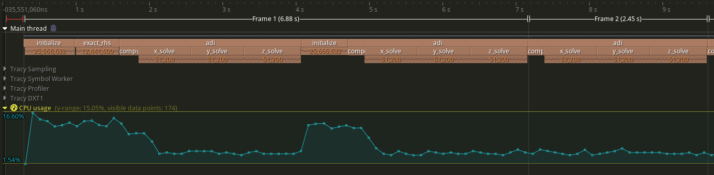

# A) Traditional profiling

## Preparation

In order to use `gprof`, `gcc` must be instructed using the flag `-pg` to
generate profile information upon running the compiled program, stored in a file
named `gmon.out`. To this end, I added `-DCMAKE_C_FLAGS=-pg` to the `cmake`
command line.

I also added `-DCMAKE_BUILD_TYPE=RelWithDebInfo`, since profiling an unoptimised
build is counterproductive.

## Output of `gprof`

Calling `gprof <binary> [<gmon.out>]` without any other arguments prints the
flat profile and call graph. Consult the man page for additional information.

I chose to focus on the workload sizes W and B for closer examination.

Note: On LCC3, the module `binutils/2.37` must be loaded, as the version of
`gprof` available by default (<2.35) is not able to process the generated
profile information.

### Flat profile

For brevity, most functions taking less than 1 percent of execution time were
omitted from the following output.

*W:*

```
  %   cumulative   self              self     total           
 time   seconds   seconds    calls  ms/call  ms/call  name    
 31.92      0.60     0.60  6712596     0.00     0.00  binvcrhs
 17.82      0.94     0.34  6712596     0.00     0.00  matmul_sub
 13.03      1.18     0.25      201     1.22     2.94  y_solve
 11.70      1.40     0.22      201     1.09     2.82  x_solve
 11.17      1.61     0.21      201     1.04     2.77  z_solve
  8.51      1.77     0.16      202     0.79     0.79  compute_rhs
  3.46      1.84     0.07  6712596     0.00     0.00  matvec_sub
  1.06      1.86     0.02   291852     0.00     0.00  binvrhs
  1.06      1.88     0.02   291852     0.00     0.00  lhsinit
  0.00      1.88     0.00   221472     0.00     0.00  exact_solution
  0.00      1.88     0.00      201     0.00     0.00  add
[...]
```

The flat profile (captured on my local machine) shows that about 29 percent of
execution time is spent in the function `binvcrhs`. A further 15 percent is
spent in `matmul_sub`, and just under 14 percent each in `x`/`y`/`z_solve`.

\pagebreak
*B:* 

```
  %   cumulative   self              self     total           
 time   seconds   seconds    calls  ms/call  ms/call  name    
 28.99     56.57    56.57 609030000     0.00     0.00  binvcrhs
 15.11     86.05    29.48 609030000     0.00     0.00  matmul_sub
 13.91    113.19    27.14      201   135.02   290.23  y_solve
 13.79    140.10    26.91      201   133.88   289.09  x_solve
 13.54    166.52    26.42      201   131.46   286.67  z_solve
  9.91    185.86    19.33      202    95.71    95.71  compute_rhs
  3.53    192.74     6.88 609030000     0.00     0.00  matvec_sub
  0.58    193.88     1.14      201     5.67     5.67  add
  0.18    194.24     0.36  6030000     0.00     0.00  binvrhs
  0.17    194.58     0.34 16980552     0.00     0.00  exact_solution
  0.15    194.88     0.30  6030000     0.00     0.00  lhsinit
[...]
```

For the larger workload size, we see that the number of calls to functions such
as `binvcrhs` and `matmul_sub` increases, while e.g. `add` is called equally as
often (but its execution time has increased from near-zero to 5.67 ms).

The distribution of time spent does not change for the busiest functions, though
e.g. only 0.15 percent of the execution time is spent in `lhsinit` (compared to
1.06 percent for the smaller workload size).

### Call graph

```
index % time    self  children    called     name
                                                 <spontaneous>
[1]    100.0    0.00  195.12                 main [1]
                0.00  193.30     201/201         adi [2]
                1.14    0.00     201/201         add [10]
                0.03    0.26       2/2           initialize [14]
                0.10    0.06       1/1           exact_rhs [15]
                0.00    0.14       1/1           verify [16]
                0.10    0.00       1/1           set_constants [17]
                0.00    0.00      22/22          timer_clear [19]
                0.00    0.00       1/1           timer_start [24]
                0.00    0.00       1/1           timer_stop [25]
                0.00    0.00       1/1           timer_read [23]
                0.00    0.00       1/1           print_results [21]
-----------------------------------------------
                0.00  193.30     201/201         main [1]
[2]     99.1    0.00  193.30     201         adi [2]
               27.14   31.20     201/201         y_solve [3]
               26.91   31.20     201/201         x_solve [4]
               26.42   31.20     201/201         z_solve [5]
               19.24    0.00     201/202         compute_rhs [8]
-----------------------------------------------
               27.14   31.20     201/201         adi [2]
[3]     29.9   27.14   31.20     201         y_solve [3]
               18.86    0.00 203010000/609030000     binvcrhs [6]
                9.83    0.00 203010000/609030000     matmul_sub [7]
                2.29    0.00 203010000/609030000     matvec_sub [9]
                0.12    0.00 2010000/6030000     binvrhs [11]
                0.10    0.00 2010000/6030000     lhsinit [13]
-----------------------------------------------
               26.91   31.20     201/201         adi [2]
[4]     29.8   26.91   31.20     201         x_solve [4]
               18.86    0.00 203010000/609030000     binvcrhs [6]
                9.83    0.00 203010000/609030000     matmul_sub [7]
                2.29    0.00 203010000/609030000     matvec_sub [9]
                0.12    0.00 2010000/6030000     binvrhs [11]
                0.10    0.00 2010000/6030000     lhsinit [13]
-----------------------------------------------
               26.42   31.20     201/201         adi [2]
[5]     29.5   26.42   31.20     201         z_solve [5]
               18.86    0.00 203010000/609030000     binvcrhs [6]
                9.83    0.00 203010000/609030000     matmul_sub [7]
                2.29    0.00 203010000/609030000     matvec_sub [9]
                0.12    0.00 2010000/6030000     binvrhs [11]
                0.10    0.00 2010000/6030000     lhsinit [13]
-----------------------------------------------
               18.86    0.00 203010000/609030000     x_solve [4]
               18.86    0.00 203010000/609030000     y_solve [3]
               18.86    0.00 203010000/609030000     z_solve [5]
[6]     29.0   56.57    0.00 609030000         binvcrhs [6]
-----------------------------------------------
[...]
```

The above (truncated) call graph reveals the following:

- The program spends almost all of its time in the function `adi`.
- `adi` calls `x`/`y`/`z_solve` as well as `compute_rhs` and has no
  computationally intensive code of its own.
- `x`/`y`/`z_solve` are *only* called from `adi`.
- `x`/`y`/`z_solve` all operate analogously to each other, are called the same
  number of times, and take up an equal share of execution time.
- `binvchrs` accounts for roughly 19 percent of the time spent in
  `x`/`y`/`z_solve`, and does not call out to any computationally intensive
  functions.

### Annotated source code

`gprof` may also be instructed to output source code with annotations --
printing an execution count beside each line with a function definition, as well
as a short summary showing which lines (functions) were executed most often.

I found this not to be of much use, as it is essentially just a less concise
form of the flat profile.

### Comparing with LCC3

The only noteworthy difference I observed in the output of `gprof` on LCC3 is
that some or all profile information for the `main` function and other functions
called from within it appears to be missing.

```
Flat profile:

Each sample counts as 0.01 seconds.
  %   cumulative   self              self     total           
 time   seconds   seconds    calls  ms/call  ms/call  name    
 30.56     96.94    96.94 609030000     0.00     0.00  binvcrhs
 17.17    151.42    54.48 609030000     0.00     0.00  matmul_sub
 13.55    194.42    43.00      201   213.92   488.12  z_solve
 11.97    232.39    37.98      201   188.94   463.14  y_solve
 11.29    268.21    35.82      201   178.22   452.41  x_solve
 10.16    300.45    32.24      202   159.58   159.58  compute_rhs
  4.05    313.28    12.83 609030000     0.00     0.00  matvec_sub
  0.63    315.28     2.00                             add
  0.18    315.86     0.58  6030000     0.00     0.00  lhsinit
  0.16    316.37     0.51  6030000     0.00     0.00  binvrhs
  0.15    316.86     0.49 16980552     0.00     0.00  exact_solution
  0.06    317.05     0.19                             exact_rhs
  0.03    317.15     0.10                             set_constants
  0.03    317.24     0.09                             initialize
  0.01    317.26     0.02        1    20.00    50.63  error_norm
  0.00    317.27     0.01        1    10.00    10.00  rhs_norm
  0.00    317.27     0.00        2     0.00     0.00  wtime_


                          Call graph


granularity: each sample hit covers 2 byte(s) for 0.00% of 317.27 seconds

index % time    self  children    called     name
                                                 <spontaneous>
[1]     99.0    0.00  314.21                 adi [1]
               43.00   55.11     201/201         z_solve [2]
               37.98   55.11     201/201         y_solve [4]
               35.82   55.11     201/201         x_solve [5]
               32.08    0.00     201/202         compute_rhs [7]
-----------------------------------------------
[...]
```

From the call graph, it appears as though `adi` was called directly at the
program entry point.\
Optimization / inlining?

# B) Hybrid trace profiling

## Preparation

Tracy must be integrated with the source code to be profiled. Tracy itself is
written in C++, and although a C API is provided via `tracy/TracyC.h`, I
switched the project language to C++ instead, which necessitated some further
adjustments to the code.

The modified source code (including relevant header and source files for Tracy
v0.10) may be found in `npb_bt_tracy`. Configure the CMake project with
`-DTRACY_ENABLE=On` to create a profiling build.

### Frames

Tracy works on the concept of "frames", as in "frames per second" in e.g. a
videogame. The macro `FrameMark` is provided to demark the end of one such
frame.

The most natural mapping to me seemed to be the loop over time steps, as it is
in effect the main loop of the program:

```
[...]
  for (step = 1; step <= niter; step++) {
    if ((step % 20) == 0 || step == 1) {
      printf(" Time step %4d\n", step);
    }

    adi();

    FrameMark;
  }
[...]
```

### Zone annotations

"Zones" are central to the concept of tracing. Thus, Tracy provides the
`ZoneScoped` macro to be added at the start of each interesting function.

Variations on the `ZoneScoped` macro are also available -- the `N` suffix for
giving the zone a custom name, the `C` suffix for setting a custom colour, and
the `S` suffix to capture the call stack at zone entry. None of these were
utilised.

Usage of zones is somewhat more involved when using the C API, which is another
reason I chose to make the existing source code C++-compatible instead.

I annotated the following functions, most of which were pointed out by `gprof`
to have at least 201 executions. The very busiest functions were not annotated
so as to limit the number of zones created, and thus the performance impact.

- `initialize`
- `add`
- `adi`
- `exact_rhs`
- `exact_solution`
- `lhsinit`
- `compute_rhs`
- `binvrhs`
- `x`/`y`/`z_solve`



The section in red before the first frame shows the time that Tracy itself took
to initialize.

As I did not put a `FrameMark` between the initialization code and the first run
of the loop, the first frame also includes the runtime of all initialization code.

CPU usage is elevated during the two calls to `initialize` -- this is due to
Tracy itself collecting profiling information for all the zones created by
`exact_solution`. For the remaining program duration, CPU usage is reported at
around 5 percent -- which amounts to full load on a single core on my system.


We can see that the initialization time amounts to roughly 2x the runtime of one
iteration of the main loop for both workload sizes W and C.

\pagebreak
## Measuring performance overhead

I compared the runtime of the modified source code for the workload sizes
W, A and C, using the following project configurations:

- none: `-DCMAKE_BUILD_TYPE=RelWithDebInfo`
- tracy: `-DCMAKE_BUILD_TYPE=RelWithDebInfo -DTRACY_ENABLE=On`
- gprof: `-DCMAKE_BUILD_TYPE=RelWithDebInfo -DCMAKE_CXX_FLAGS=-pg`

This amounts in all cases to a build with optimization level `-O2` and debug
symbols included.

Note that due to changing the project language to C++, the variable
`CMAKE_CXX_FLAGS` was used in place of `CMAKE_C_FLAGS` (as in the first part of
this exercise sheet).

All benchmarks were conducted on a Ryzen 9 5900X. Workload size `C` was tested only once, with all
three variants being run simultaneously and bound to cores 0, 2 and 4 of CCD 0 respectively (in
order to ensure that none have a thermal / clock speed advantage). The other workload sizes were run
in sequence and averaged over five runs each. The Tracy profiling application was not running during
the test.

\begin{center}
\begin{tabular}{|l|l|r r r|r r r|r|}
    \hline
                &               & \multicolumn{3}{c|}{\textbf{Mean}}    
                                & \multicolumn{3}{c|}{\textbf{Variance}} 
                                & \\
    Workload    & Configuration & wall & user & system      & wall & user & system  & Overhead \\
    \hline

    W           & none          & 1.206  & 1.204  & 0.000   & 0.001 & 0.001 & 0.000 & - \\
                & tracy         & 1.514  & 1.244  & 0.158   & 0.000 & 0.000 & 0.000 & $+25.54 \%$ \\
                & gprof         & 1.252  & 1.248  & 0.000   & 0.001 & 0.001 & 0.000 & $+ 3.81 \%$ \\
    \hline

    A           & none          & 26.316 & 26.282 & 0.028   & 0.174 & 0.173 & 0.000 & - \\
                & tracy         & 29.172 & 28.188 & 1.376   & 0.095 & 0.099 & 0.002 & $+10.85 \%$ \\
                & gprof         & 28.146 & 28.100 & 0.038   & 0.240 & 0.237 & 0.000 & $+ 6.95 \%$ \\
    \hline

    C           & none          & 461.94 & 459.90 & 1.98    & - & - & - & - \\
                & tracy         & 523.89 & 501.04 & 22.44   & - & - & - & $+13.41 \%$ \\
                & gprof         & 499.26 & 498.26 & 0.78    & - & - & - & $+ 8.08 \%$ \\
    \hline
\end{tabular}
\end{center}

### Observations

- Tracy, as used here, has a greater performance overhead than `gprof`, and the
  overhead is most exaggerated for the small workload size.

- The unprofiled program runs almost entirely in userspace (> 99.5 percent).
  Tracy evidently adds a lot of context switches, raising the time spent in
  kernel space to just over 4 percent -- likely due to its TCP-based
  communication. `perf stat` (run as `root`) confirms this:

    **none:**

    ```
     Performance counter stats for './npb_bt_w':

              1,223.56 msec task-clock                       #    1.000 CPUs utilized             
                     1      context-switches                 #    0.817 /sec                      
    [...]
    ```

    **tracy:**

    ```
     Performance counter stats for './npb_bt_w':

              1,386.54 msec task-clock                       #    0.879 CPUs utilized             
                 1,476      context-switches                 #    1.065 K/sec                     
    [...]
    ```

- Curiously, the `gprof` configuration spent less time in kernel space for
  workload size C, and this held true for a second run (not included in the
  table).
