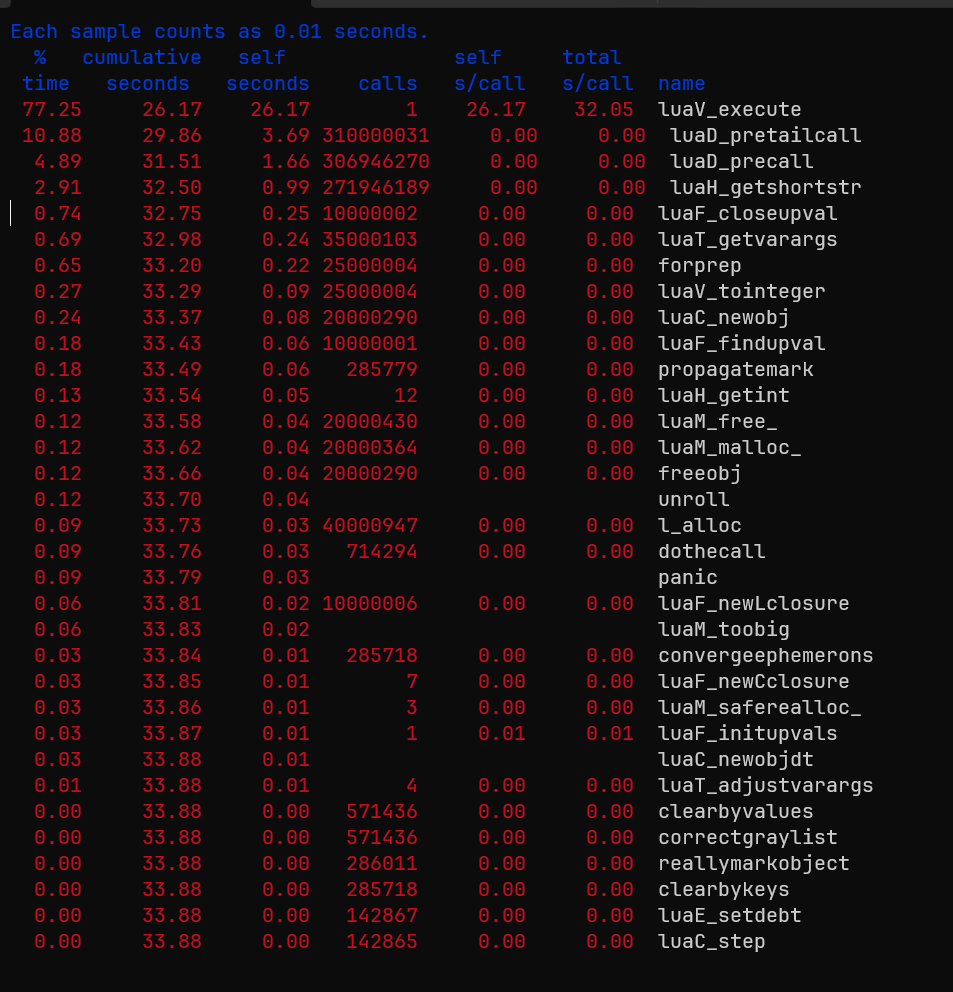
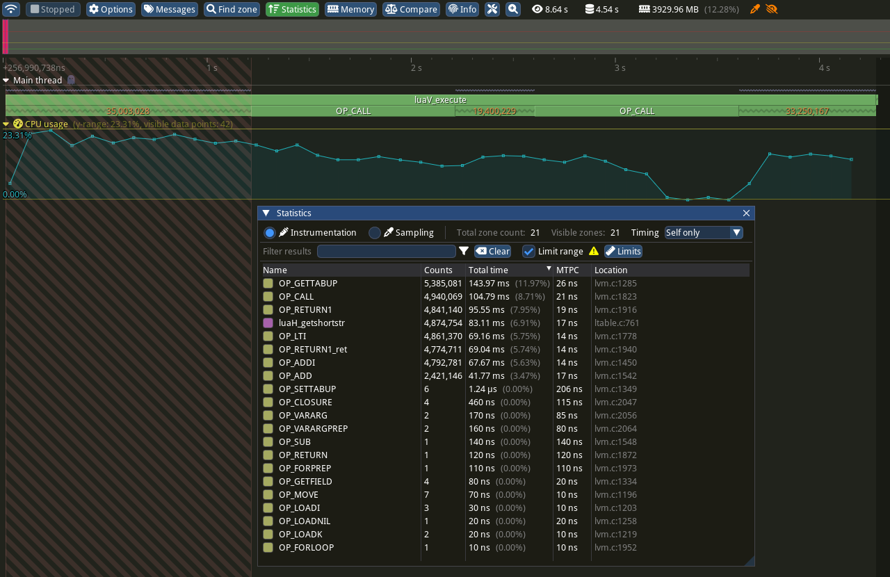
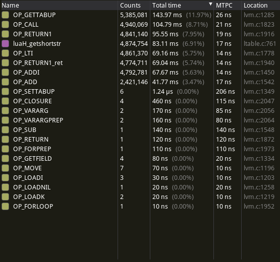
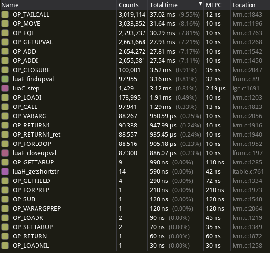
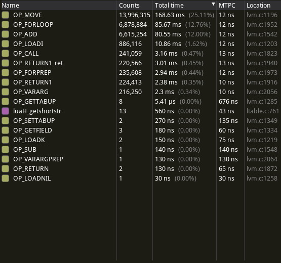
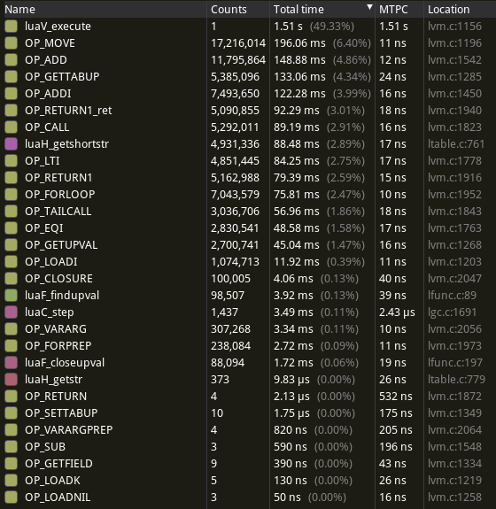

# A) Setup and Basic Execution

Benchmark results with default Lua interpreter compilation (-O2):

| test  | wall (mean) | wall (stddev) |
| ----- | ----------- | ------------- |
| naive | 12.5483     | 0.322         |
| tail  | 12.5980     | 0.046         |
| iter  | 10.8730     | 0.036         |

# B) Profiling

## Profiling with Gprof

### Setup

We first had to recompile the interpreter with the added `-pg` flag. We had some
issues with the output so we had to add `-g` and `-no-pie` aswell to get a good output.

Those flags were very easy to set in the Makefile in the `/src/` directory as
there was a place for custom flags.

### Results



From the flat profile we get by gprof we can see that 77.25% of the time is
spent in the function `luaV_execute` that is therefore a function we should have
a look at, here it's also interesting to note that we only have one call to this
function, so it might also be something like a main.

Next in the ranking is the function `luaD_pretailcall` with 10.88% of the
execution time, this function has a lot of calls on it (306,946,270), which
means that even a small percentage improvement could have a big impact.

The same goes for `luaD_precall`.

The full profile can be found in `gprof_results.txt`.

## Profiling with Tracy

The modified source code including `Makefile` can be found in the `lua_tracy/`
directory.
To enable Tracy, compile with `make EXTRACFLAGS=-DTRACY_ENABLE`. To additionally
enable per-opcode zones (refer to the section "Opcode Statistics"), compile with
`make EXTRACFLAGS='-DTRACY_ENABLE -DOPCODE_ZONES'`.

The `-g` flag was added to the default compilation flags in order to make
Tracy's source code view would work properly. This did not appear to
significantly impact runtime, at least on my machine.

We added the `ZoneScoped` macro to the following functions:

- `luaV_execute`
- `luaF_findupval`
- `luaF_closeupval`
- `luaH_getstr`
- `luaH_getshortstr`
- `luaC_step`

Additionally, we added a `FrameMark` to the end of the interpreter loop in an
attempt to measure the number of opcodes executed per second, although this is
seemingly never hit.

Most of the runtime is spent, unsurprisingly, directly inside the main
interpreter loop.

### Which Opcodes?

Using the Source view in the Tracy Profiler application, we can narrow down the
Lua Virtual Machine opcodes that are actually used by the `fib.lua` benchmark:

(This is also possible using e.g. `perf report`, although Tracy's UI is much
more navigable.)

- `OP_MOVE`
- `OP_LOADI`
- `OP_LOADK`
- `OP_GETUPVAL`
- `OP_GETTABUP`
- `OP_GETFIELD`
- `OP_SELF`
- `OP_ADDI`
- `OP_ADD`
- `OP_EQI`
- `OP_LTI`
- `OP_GEI`
- `OP_TESTSET`
- `OP_CALL`
- `OP_TAILCALL`
- `OP_RETURN1`
- `OP_FORLOOP`
- `OP_FORPREP`
- `OP_TFORLOOP`
- `OP_CLOSURE`
- `OP_VARARG`
- `OP_VARARGPREP`
- `OP_EXTRAARG`

This represents a small subset of the opcodes available in the interpreter,
giving a better idea of where optimizations should be made.

### Opcode Statistics

To get an idea of which opcodes are executed how often, we added named zones to
each opcode in the `luaV_execute` function as follows:

```c
vmdispatch (GET_OPCODE(i)) {
    // [...]
    vmcase(OP_LTI) {
        TracyCZoneN(ctx, "OP_LTI", true);
        op_orderI(L, l_lti, Luai_numlt, 0, TM_LT);
        TracyCZoneEnd(ctx);
        vmbreak;
    }
    // [...]
}
```

Special care had to be taken around `goto` statements in the interpreter,
particularly around `OP_RETURN1` and the `ret` label.

As the large number of zones created this way quickly overwhelms the Tracy
Profiler host application, we created a modified version of the `fib.lua` script
that calls each `fibonacci_` variant only 1/100x as often, and sleeps for one second
in between testing the three variants:

Note that this _did_ have a substantial performance impact, increasing the
runtime by a factor of 2-4.

```lua
-- [...]

t, v = measure(1, fibonacci_naive, 30)
print(string.format("1 x fibonacci_naive(30)     time: %8.4f s  --  %s", t, v))

os.execute("sleep 1")

t, v = measure(100000, fibonacci_tail, 30)
print(string.format("100000 x fibonacci_tail(30) time: %8.4f s  --  %s", t, v))

os.execute("sleep 1")

t, v = measure(250000, fibonacci_iter, 30)
print(string.format("250000 x fibonacci_iter(30) time: %8.4f s  --  %s", t, v))
```

The following screenshot shows

1. the overall execution profile (note the 1-second long `OP_CALL` zones in
   between the orange-numbered ones representing the `sleep` durations).
2. statistics for `100x fibonacci_naive` (obtained by right-clicking on
   the first orange-numbered section, choosing "Limit statistics time range",
   then opening the Statistics window using the button at the top).



All opcode statistics are shown in the following screenshots.

{ width=50% }

{ width=50% }

{ width=50% }

{ width=50% }

### Main Takeaways

- `fibonacci_naive` makes many, many calls to `getshortstr` via `OP_GETTABUP` --
  we assume this has to do with accessing the variable `n` from within recursive
  calls.

- `OP_GETTABUP` is used much more often than `OP_SETTABUP` and its
  mean-time-per-call is roughly twice that of other opcodes. Optimising
  `OP_GETTABUP` at the expense of `OP_SETTABUP` is probably a good call for this
  benchmark.

- `fibonacci_tail` calls `findupval` and `closeupval` roughly once per
  iteration. This is related to creation of the "inner" closure via
  `OP_CLOSURE`.

- The garbage collector (`luaC_step`) runs most often during `fibonacci_tail` --
  taking up about as much runtime as `findupval`.

- `OP_MOVE`, `OP_FORLOOP` and `OP_ADD` represent the bulk of the opcodes used by
  `fibonacci_iter` with several million calls each.

## Conclusion

We decided to take a look at the functions using the most time and tried to
optimize them in exercise D.

# C) Code Understanding

## Overall process of Lua execution in the interpreter

- Loading: The Lua interpreter reads the script from a file or string.
- Lexical Analysis (Lexing): The script is broken down into tokens.
- Syntax Analysis (Parsing): The tokens are parsed to create an Abstract Syntax
  Tree (AST).
- Code Generation: The AST is converted into bytecode, which is the intermediate
  representation of the script.
- Execution: The bytecode is executed by the Lua Virtual Machine (VM).

## `LUA_USE_JUMPTABLE`

The bulk of the main loop of the interpreter is taken up by a `switch`/`case`
construct, with one `case` label per opcode supported by the Lua Virtual Machine
(e.g. `case OP_MOVE:`).

When the macro `LUA_USE_JUMPTABLE` is defined and not zero (default on GCC and
compatible compilers), the `switch`/`case` construct is replaced with a
manually-defined jump table:

1. Instead of a `case` label, each Virtual Machine opcode is assigned a
   "regular" label (e.g. `L_OP_MOVE:`), and the addresses for each of these are
   stored in the table.

2. Immediately after an opcode has been processed, the next opcode is fetched
   and execution is transferred to its corresponding label using `goto` -- as
   opposed to `break`ing out of the `switch` block, then fetching and jumping to
   the next opcode on the next loop iteration.

While the `switch`/`case` construct is also a jump table, the idea of
constructing one manually is that, by avoiding a jump back to the top of the
interpreter loop before processing the next opcode, performance could be
improved.

However as Roberto (creator of Lua) [noted in
2018](https://narkive.com/nHwpbBsr.8), it may actually cause performance
_regressions_ on some systems.

We tested how the performance metrics change when disabling the jump table
across ten runs of `fib.lua` on LCC3. Overall, we found that disabling the jump
table _does_ help runtime. The runtime with the jump table disabled is slower by
2--3 standard deviations for the `naive` and `tail` variants, and by 0.8 seconds
(~22x std. dev.) for the `iter` variant.

| test                 | wall (mean) | wall (stddev) |
| -------------------- | ----------- | ------------- |
| naive                | 12.5483     | 0.322         |
| naive (no jumptable) | 13.0791     | 0.132         |
| tail                 | 12.5980     | 0.046         |
| tail (no jumptable)  | 12.7281     | 0.047         |
| iter                 | 10.8730     | 0.036         |
| iter (no jumptable)  | 11.6786     | 0.017         |

# (D) Optimization

## Varying the compilation flags

We tried different compiler flags -- this did not produce any meaningful
improvements. With the exception of `fibonacci_tail`, compiling with `-O3` or
`-Ofast` made performance _worse_; the fairly substantial improvement `-Ofast`
achieves in `fibonacci_tail` is outweighed by the equally substantial deficit in
`naive` and `iter`.

Applying individual flags from the `-O3` optimization level in addition to `-O2`
also did not have any meaningful impact. The greatest improvement achieved by a
single flag was with `-fsplit-paths`, being 0.15 seconds (~1.33\%) faster than
`-O2` for `fibonacci_tail`, and not significantly slower for the other tests.

### `-fsplit-paths`

| test  | wall (mean) | wall (stddev) | \% vs stock `-O2` |
| ----- | ----------- | ------------- | ----------------- |
| naive | 12.5352     | 0.384         | 99.90             |
| tail  | 12.4299     | 0.043         | 98.67             |
| iter  | 10.8815     | 0.040         | 100.08            |

### `-O3`

| test  | wall (mean) | wall (stddev) | \% vs stock `-O2` |
| ----- | ----------- | ------------- | ----------------- |
| naive | 13.4102     | 0.296         | 106.87            |
| tail  | 12.5004     | 0.020         | 99.23             |
| iter  | 12.2039     | 0.042         | 112.24            |

### `-Ofast`

| test  | wall (mean) | wall (stddev) | \% vs stock `-O2` |
| ----- | ----------- | ------------- | ----------------- |
| naive | 12.7103     | 0.306         | 101.29            |
| tail  | 12.0485     | 0.018         | 95.64             |
| iter  | 11.6290     | 0.031         | 106.95            |

All mean results are contained in the file named `flag_results.csv`.

## Improving Lua source code

### Inlining

We tried to improve the functions mentioned in _B - Profiling with Gprof_. We
tried to inline external function calls. However the only function that was no
define which is inlined by the compiler anyway was `prepCallInfo` in
`luaD_precall` in `ldo.c`. (Note: Only adapted the last case, as it is use for
running Lua files and our benchmark is in Lua)

The results were slightly faster for the `tail` variant, and slower for the
`iter` variant.

**Results** (mean of 5 runs):

| test  | wall (mean) |
| ----- | ----------- |
| naive | 12.5514     |
| tail  | 12.1623     |
| iter  | 11.5557     |

The adapted code looks like this:

```c
CallInfo *luaD_precall (lua_State *L, StkId func, int nresults) {
 retry:
  switch (ttypetag(s2v(func))) {
    case LUA_VCCL:  /* C closure */
      precallC(L, func, nresults, clCvalue(s2v(func))->f);
      return NULL;
    case LUA_VLCF:  /* light C function */
      precallC(L, func, nresults, fvalue(s2v(func)));
      return NULL;
    case LUA_VLCL: {  /* Lua function */
      CallInfo *ci;
      Proto *p = clLvalue(s2v(func))->p;
      int narg = cast_int(L->top.p - func) - 1;  /* number of real arguments */
      int nfixparams = p->numparams;
      int fsize = p->maxstacksize;  /* frame size */
      checkstackGCp(L, fsize, func);

      // ####################################### try inlining this function
      // original code
      //L->ci = ci = prepCallInfo(L, func, nresults, 0, func + 1 + fsize);
      // #######################################

      ci = L->ci = next_ci(L);  /* new frame */
      ci->func.p = func;
      ci->nresults = nresults;
      ci->callstatus = 0;
      ci->top.p = func + 1 + fsize;

      L->ci = ci;

      // #######################################
      // original function
      //l_sinline CallInfo *prepCallInfo (lua_State *L, StkId func, int nret,
      //                                          int mask, StkId top) {
      //CallInfo *ci = L->ci = next_ci(L);  /* new frame */
      //ci->func.p = func;
      //ci->nresults = nret;
      //ci->callstatus = mask;
      //ci->top.p = top;
      //return ci;
      //}

      // #######################################

      ci->u.l.savedpc = p->code;  /* starting point */
      for (; narg < nfixparams; narg++)
        setnilvalue(s2v(L->top.p++));  /* complete missing arguments */
      Lua_assert(ci->top.p <= L->stack_last.p);
      return ci;
    }
    default: {  /* not a function */
      func = LuaD_tryfuncTM(L, func);  /* try to get '__call' metamethod */
      /* return LuaD_precall(L, func, nresults); */
      goto retry;  /* try again with metamethod */
    }
  }
}
```

### Reordering opcodes

From the tracy results we can see that some of the opcodes are called very
often and some are never used. We reorder them in the switch case ranking from
most to least calls.

**Results** (mean of 5 runs, including inlining):

| test  | wall (mean) |
| ----- | ----------- |
| naive | 12.5136     |
| tail  | 12.2710     |
| iter  | 11.5575     |

We see slight improvements for naive and iter in comparison to only inlining.
However tail is slower. The results are pretty similar and improve some
benchmarks while making others worse. This is likely due to random variance and
reordering doesn't really accomplish anything.

### Caching / Memoization

Improving the op calls themselves seemed very difficult. Probably implementing
caching / memoization would rapidly improve the benchmark for a problem like
fibonacci calculation. However implementing this in the Lua interpreters source
code and not simply adding memoization to the `.lua` file would exceed the
scope of this exercise sheet.

## Using a custom memory allocator for the Lua interpreter

As we had good experience with custom memory allocators in terms of performance
improvements in previous exercises, we decided to try `mimalloc` and see if it
can improve the perfomance.

### Mimalloc Setup

First we build mimalloc from source, as described in the repository. After that
we added the Flag `-lmimalloc` during the build of the interpreter to use it for
all the allocations.

### Mimalloc Results

Unfortunately mimalloc couldn't really speed up the execution times for this
scenario.

The baseline results were (mean of 10 runs):

| test  | wall (mean) |
| ----- | ----------- |
| naive | 12.7706     |
| tail  | 12.6074     |
| iter  | 10.8779     |

And with mimalloc:

| test  | wall (mean) |
| ----- | ----------- |
| naive | 12.5884     |
| tail  | 12.6433     |
| iter  | 10.9223     |

We can see that the "improvements" fall within a margin of error. Our possible
explanations for that were:

1. The program probably is rather compute bound and not so heavy on the memory.

2. Maybe Lua already uses a non-default memory allocator / they have their own
   implementation. A look in the source code, we can see the file `lmem.c` which
   contains the implementation of Lua's memory handling. Of course this is
   completed by the garbage collector in seperate files.
