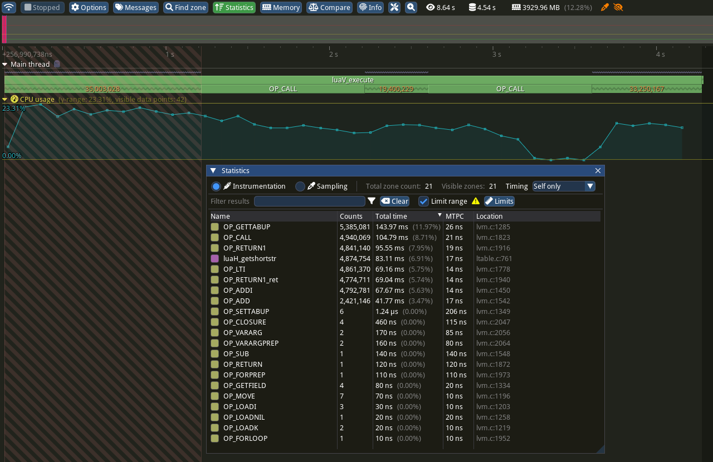
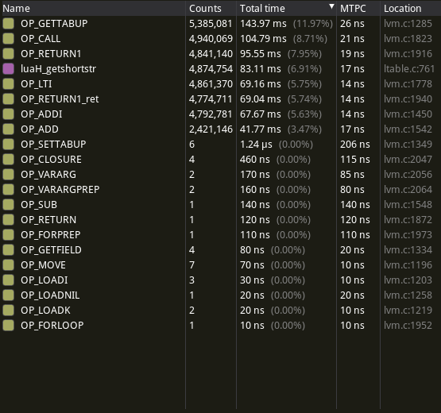
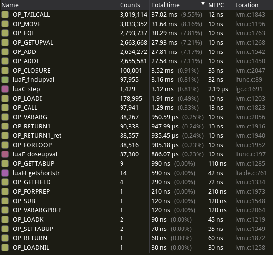
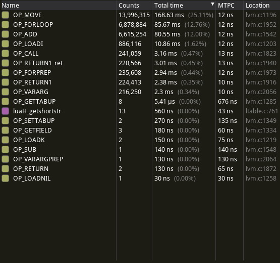
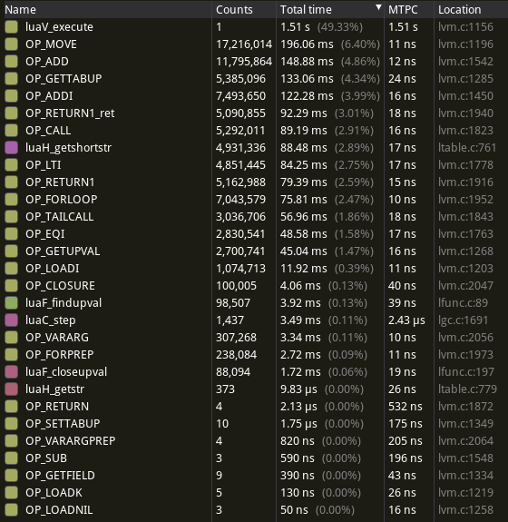

## Profiling With Tracy

The modified source code including `Makefile` can be found in the `lua_tracy/`
directory.
To enable Tracy, compile with `make EXTRACFLAGS=-DTRACY_ENABLE`. To additionally
enable per-opcode zones (refer to the section "Opcode Statistics"), compile with
`make EXTRACFLAGS=-DTRACY_ENABLE`.

The `-g` flag was added to the default compilation flags in order to make
Tracy's source code view would work properly. This did not appear to
significantly impact runtime, at least on my machine.

I added the `ZoneScoped` macro to the following functions:

- `luaV_execute`
- `luaF_findupval`
- `luaF_closeupval`
- `luaH_getstr`
- `luaH_getshortstr`
- `luaC_step`

Additionally, I added a `FrameMark` to the end of the interpreter loop in an
attempt to measure the number of opcodes executed per second, although this is
seemingly never hit.

Most of the runtime is spent, unsurprisingly, directly inside the main
interpreter loop.

### Which Opcodes?

Using the Source view in the Tracy Profiler application, we can narrow down the
Lua Virtual Machine opcodes that are actually used by the `fib.lua` benchmark:

(This is also possible using e.g. `perf report`, although Tracy's UI is much
more navigable.)

- `OP_MOVE`
- `OP_LOADI`
- `OP_LOADK`
- `OP_GETUPVAL`
- `OP_GETTABUP`
- `OP_GETFIELD`
- `OP_SELF`
- `OP_ADDI`
- `OP_ADD`
- `OP_EQI`
- `OP_LTI`
- `OP_GEI`
- `OP_TESTSET`
- `OP_CALL`
- `OP_TAILCALL`
- `OP_RETURN1`
- `OP_FORLOOP`
- `OP_FORPREP`
- `OP_TFORLOOP`
- `OP_CLOSURE`
- `OP_VARARG`
- `OP_VARARGPREP`
- `OP_EXTRAARG`

This represents a small subset of the opcodes available in the interpreter,
giving a better idea of where optimisations should be made.

### Opcode Statistics

To get an idea of which opcodes are executed how often, I added named zones to
each opcode in the `luaV_execute` function as follows:

```c
vmdispatch (GET_OPCODE(i)) {
    // [...]
    vmcase(OP_LTI) {
        TracyCZoneN(ctx, "OP_LTI", true);
        op_orderI(L, l_lti, luai_numlt, 0, TM_LT);
        TracyCZoneEnd(ctx);
        vmbreak;
    }
    // [...]
}
```

Special care had to be taken around `goto` statements in the interpreter,
particularly around `OP_RETURN1` and the `ret` label.

As the large number of zones created this way quickly overwhelms the Tracy
Profiler host application, I created a modified version of the `fib.lua` script
that calls each `fibonacci_` variant only 1/100x as often, and sleeps for one second
in between testing the three variants:

Note that this *did* have a substantial performance impact, increasing the
runtime by a factor of 2-4.

```lua
-- [...]

t, v = measure(1, fibonacci_naive, 30)
print(string.format("1 x fibonacci_naive(30)     time: %8.4f s  --  %s", t, v))

os.execute("sleep 1")

t, v = measure(100000, fibonacci_tail, 30)
print(string.format("100000 x fibonacci_tail(30) time: %8.4f s  --  %s", t, v))

os.execute("sleep 1")

t, v = measure(250000, fibonacci_iter, 30)
print(string.format("250000 x fibonacci_iter(30) time: %8.4f s  --  %s", t, v))
```

The following screenshot shows

1. the overall execution profile (note the 1-second long `OP_CALL` zones in
   between the orange-numbered ones representing the `sleep` durations).
2. statistics for `100x fibonacci_naive` (obtained by right-clicking on
   the first orange-numbered section, choosing "Limit statistics time range",
   then opening the Statistics window using the button at the top).



All opcode statistics are shown in the following screenshots.







### Main Takeaways

- `fibonacci_naive` makes many, many calls to `getshortstr` via `OP_GETTABUP` --
  I assume this has to do with accessing the variable `n` from within recursive
  calls.

- `OP_GETTABUP` is used much more often than `OP_SETTABUP` and its
  mean-time-per-call is roughly twice that of other opcodes. Optimising
  `OP_GETTABUP` at the expense of `OP_SETTABUP` is probably a good call for this
  benchmark.

- `fibonacci_tail` calls `findupval` and `closeupval` roughly once per
  iteration. This is related to creation of the "inner" closure via
  `OP_CLOSURE`.

- The garbage collector (`luaC_step`) runs most often during `fibonacci_tail` --
  taking up about as much runtime as `findupval`.

- `OP_MOVE`, `OP_FORLOOP` and `OP_ADD` represent the bulk of the opcodes used by
  `fibonacci_iter` with several million calls each.
